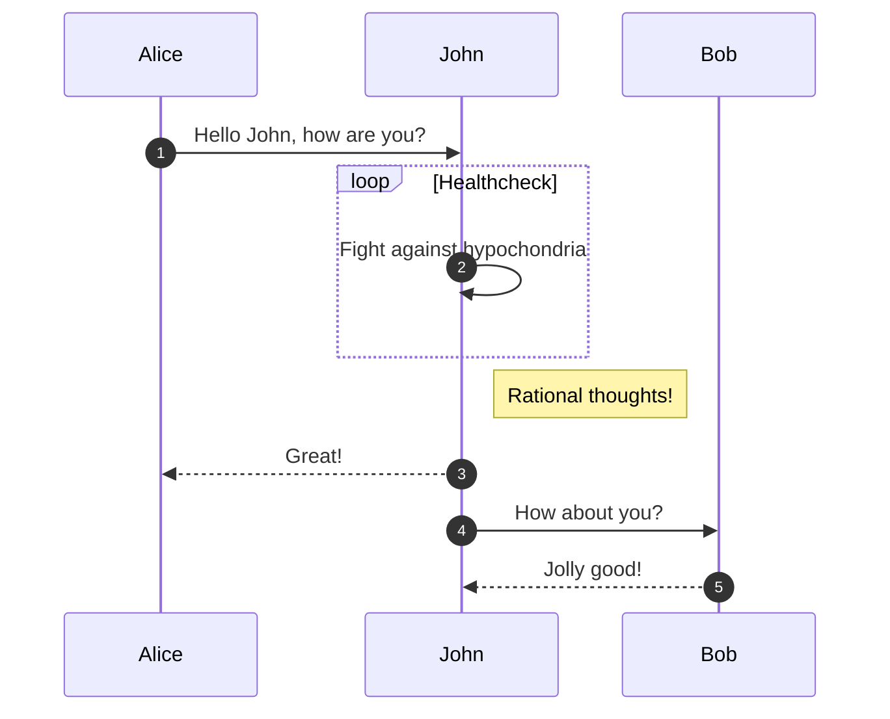
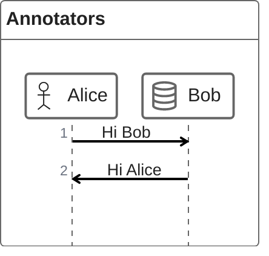

# CheckPOC

<!DOCTYPE html>
<html lang="en">
   <head>
	 
    </head>
	 
<body>
 <pre><code class="language-mermaid">graph LR
A--&gt;B
</code></pre>

graph LR
A--&gt;B

	
</body>

</html>

| Projects | Operating Systems | Programming Languages   | CAM/CAD Programs | Microcontrollers and Processors | 
|---------------------------------- |---------------|---------------|----------------|-----------|
| <ul><li>[x] Blog </li></ul>       | <ul><li>[ ] CentOS</li></ul>        | <ul><li>[ ] Python </li></ul> | <ul><li>[ ] AutoCAD Electrical </li></ul> | <ul><li>[ ] Arduino </li></ul> |
| <ul><li>[ ] PyGame</li></ul>   | <ul><li>[ ] Fedora </li></ul>       | <ul><li>[ ] C</li></ul> | <ul><li>[ ] 3DsMax </li></ul> |<ul><li>[ ] Raspberry Pi </li></ul> |
| <ul><li>[ ] Server Info Display</li></ul>| <ul><li>[ ] Ubuntu</li></ul> | <ul><li>[ ] C++ </li></ul> | <ul><li>[ ] Adobe AfterEffects </li></ul> |<ul><li>[ ]  </li></ul> |
| <ul><li>[ ] Twitter Subs Bot </li></ul> | <ul><li>[ ] ROS </li></ul>    | <ul><li>[ ] C# </li></ul> | <ul><li>[ ] Adobe Illustrator </li></ul> |<ul><li>[ ]  </li></ul> |

- [ ] Mercury
- [x] Venus
- [x] Earth (Orbit/Moon)
- [x] Mars
- [ ] Jupiter
- [ ] Saturn
- [ ] Uranus
- [ ] Neptune
- [ ] Comet Haley
